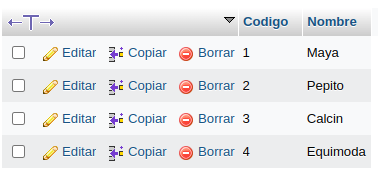
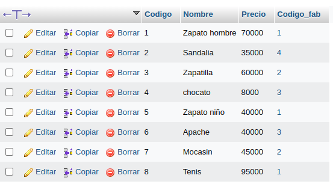
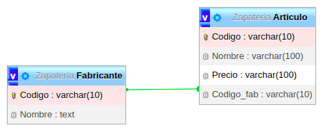
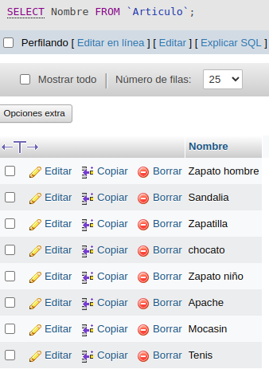
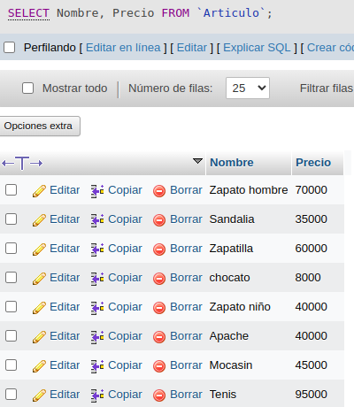
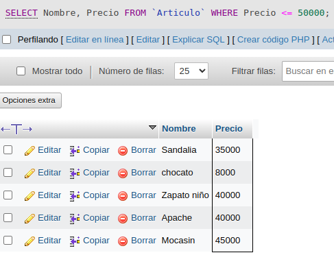

# Creación de BD y consultas
# Registro de BASE DE DATOS

# Base de Datos:

### Zapateria: Fabricante, Articulo

## Tablas: 

### Fabricante: Codigo, Nombre

### Articulo: Codigo, Nombre, Precio, Codigo_fab

## Fabricante:

### Codigo: 1, 2, 3, 4

### Nombre: Maya, Pepito, Calcin, Equimoda

## Articulo: 

### Codigo: 1, 2, 3, 4, 5, 6, 7, 8

#### Nombre: Zapato hombre, Sandalia, Zapatilla, Chocato Zapato niño, Apache, Mocasin, Tenis

### Precio: 70000, 35000, 60000, 8000, 40000, 40000,  45000, 95000

### Codigo_fab: 1, 4, 2, 3, 1, 3, 2,1

# Dicionario de datos

##           Fabricante         

| Campo  | Tipo de dato | Longitud |
|--------|--------------|----------|
| Codigo |   varchar    |    15    |
| Nombre |     text     |    15    |

##           Articulo 

|   Campo    | Tipo de dato | Longitud |
|------------|--------------|----------|
|   Codigo   |   varchar    |    15    |
|   Nombre   |     text     |    100   |
|   Precio   |   varchar    |    100   |
| codigo_fab |   varchar    |    10    |

# Tablas

## Fabricante:

## Articulo:

##  Tipo de Relación: Uno a muchos

#  Consultas BD Zapatería

## Consulta N°1

### Obtener los nombres de los productos de la Zapateria.

' SELECT Nombre FROM `Articulo`; '

## Consulta N°2

### Obtener los nombres y los precios de los productos de la Zapatería.

' SELECT Nombre, Precio FROM `Articulo`; '

## Consulta N°3

### Obtener el nombre de los productos cuyo precio sea menor o igual a 5000.

' SELECT Nombre, Precio FROM `Articulo` WHERE Precio <= 50000; '

## Consulta N°4

### Obtener todos los datos de los artículos cuyo precio esté entre 5000 y 40000 (ambas canditades incluidas).

'  '

## Consulta N°5

### Obtener el nombre y el precio de cada artículo, en dolares.

'  '

## Consulta N°6

### Obtener el precio promedio de todos los artículos.

'  '

## Consulta N°7

### Obtener el precio medio de los artículos cuyo codigo de fabricante sea 2.

'  '

## Consulta N°8

### Obtener el número de artículos cuyo precio sea mayor o igual a 50000.

'  '

## Consulta N°9

### Obtener el nombre y precio de los artículos cuyo precio sea mayor o igual a 50000 y ordenarlos descendentemente por precio, y luego ascendentemente por nombre.

'  '

## Consulta N°10

### Obtener un listado completo de artículos, incluyendo por cada articulo los datos del artículo y de su fabricante.

'  '

## Consulta N°11

### Obtener un listado de articulos, incluyendo el nombre del articulo, su precio y el nombre de su fabricante.

'  '

## Consulta N°12

### Obtener el precio medio de los productos  de cada frabricante, mostrando solo los codigos de fabricante.
'  '

## Consulta N°13

### Obtener el precio medio de los productos de cada fabricante, mostrando el nombre del fabricante.

'  '

## Consulta N°14

### Obtener el nombre de los fabricantes que ofrezcan productos cuyo precio medio sea mayor o igual a 50000.

'  '

## Consulta N°15

### Obtener el nombre y el precio del artículo mas barato.

'  '

